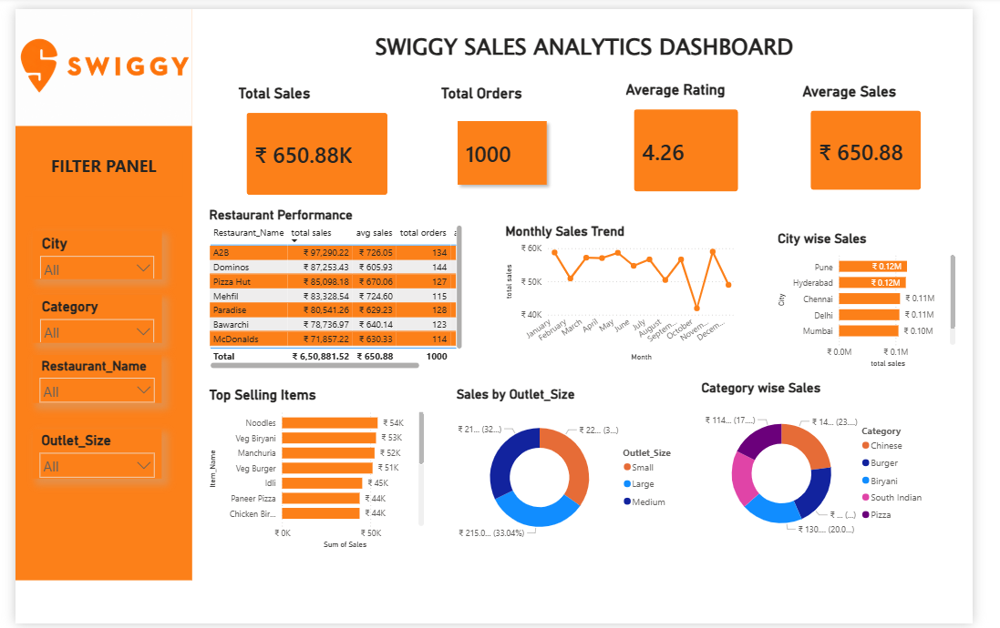

Swiggy Sales Analytics Dashboard | Power BI
📌 Project Overview

This project is an interactive Swiggy Sales Analytics Dashboard developed using Power BI. The dashboard provides valuable insights into sales performance, customer ratings, restaurant performance, category-wise sales distribution, and city-wise sales trends.

The objective of this project is to transform raw sales data into meaningful business insights through interactive visualizations and KPI tracking.

📊 Dashboard Features
Key Performance Indicators (KPIs)
💰 Total Sales
📦 Total Orders
⭐ Average Rating
📈 Average Sales

Interactive Filters
City
Category
Restaurant Name
Outlet Size
Visualizations
Monthly Sales Trend Analysis
City-wise Sales Performance
Category-wise Sales Distribution
Sales by Outlet Size
Top Selling Items
Restaurant Performance Analysis

🛠️ Tools & Technologies Used
Power BI
Power Query
DAX (Data Analysis Expressions)
Data Modeling
Data Visualization

📈 Business Insights
Identified top-performing cities based on sales.
Analyzed category-wise contribution to total revenue.
Evaluated restaurant performance using sales and order metrics.
Compared outlet sizes to understand revenue distribution.
Tracked monthly sales trends for business decision-making.

🎯 Skills Demonstrated
Data Cleaning & Transformation
Data Modeling
KPI Development
Dashboard Design
Business Intelligence Reporting
Interactive Data Visualization
📷 Dashboard Preview

Add your dashboard screenshot here.

🚀 Project Outcome
The dashboard enables stakeholders to monitor sales performance, identify growth opportunities, and make data-driven business decisions through an intuitive and interactive reporting experience.
